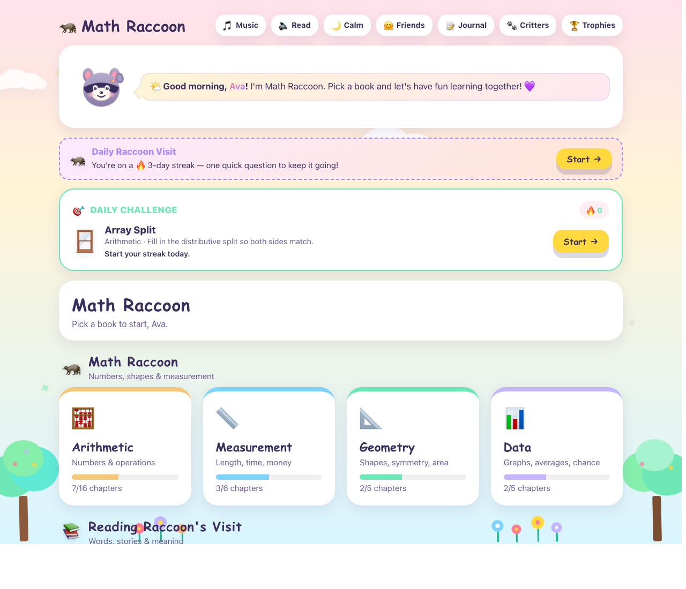
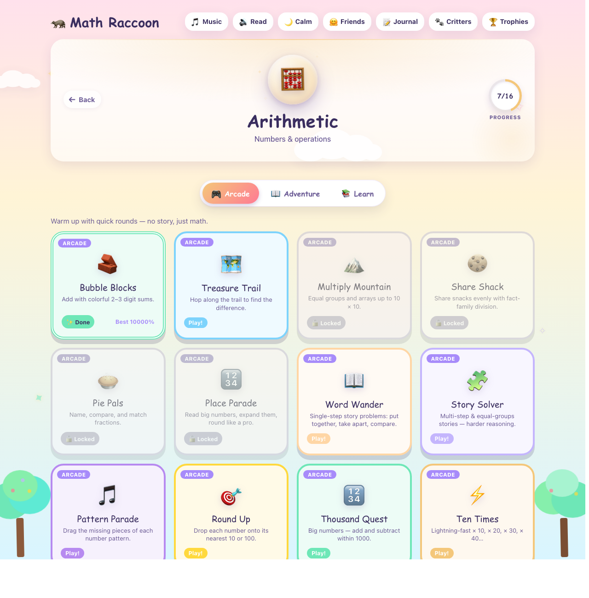
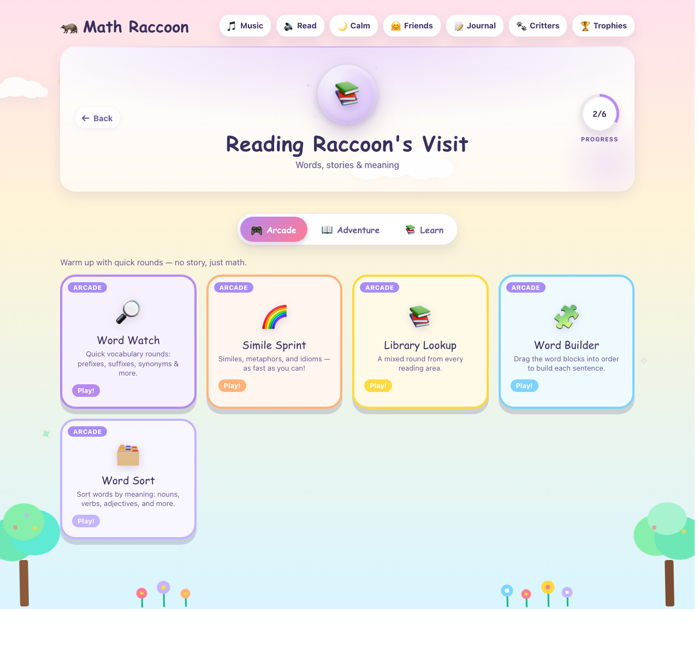
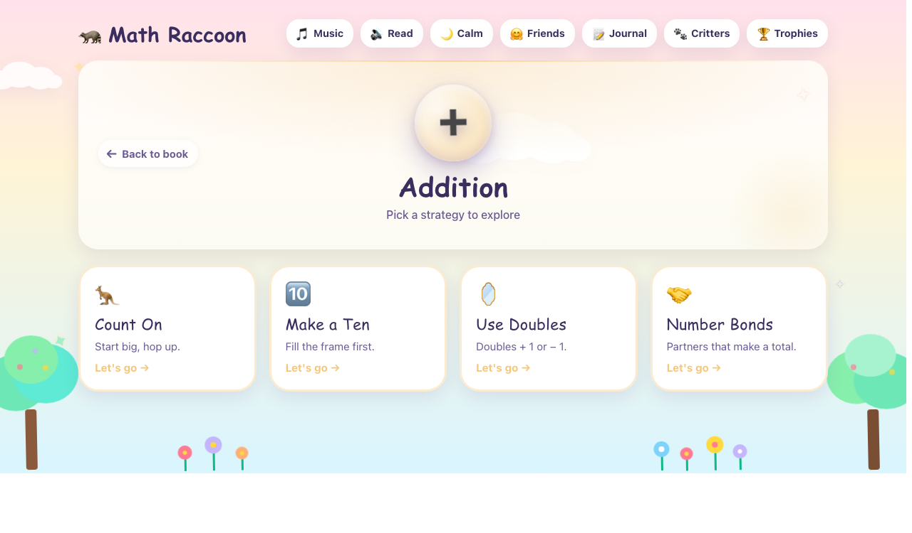
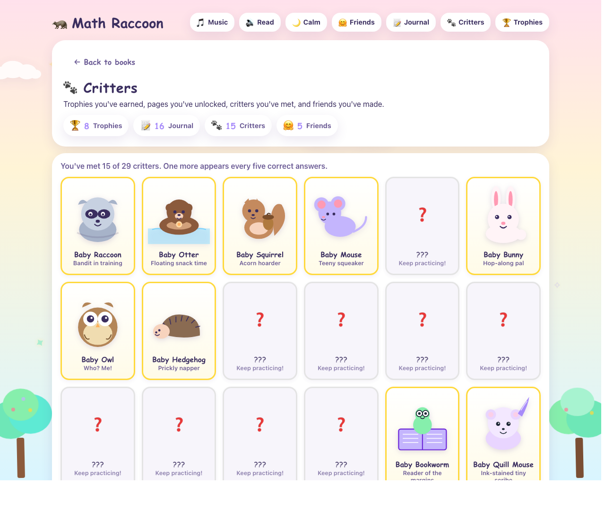
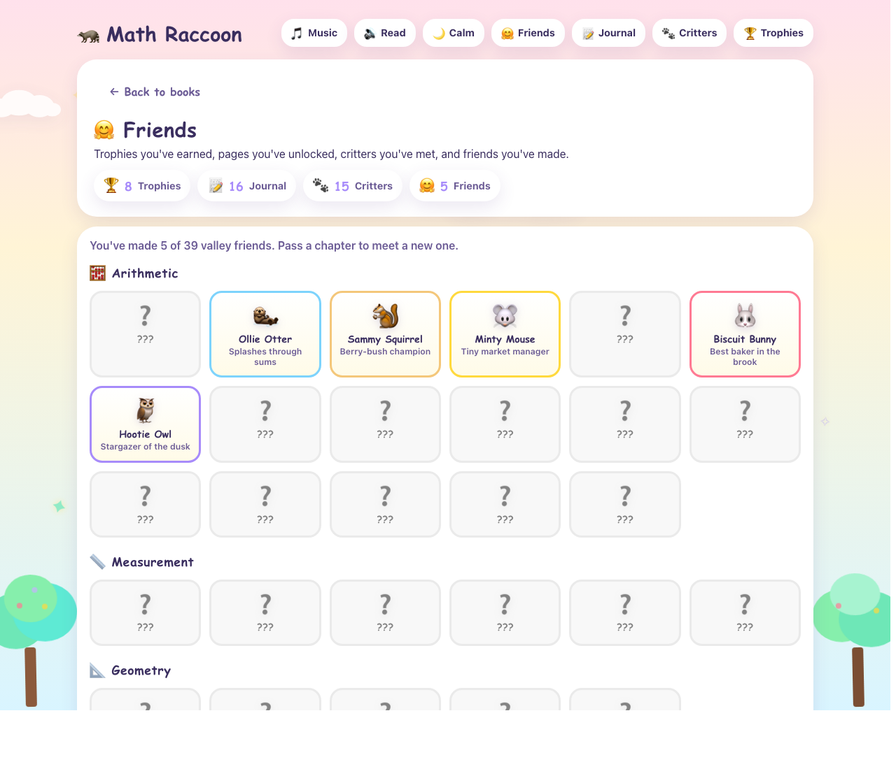
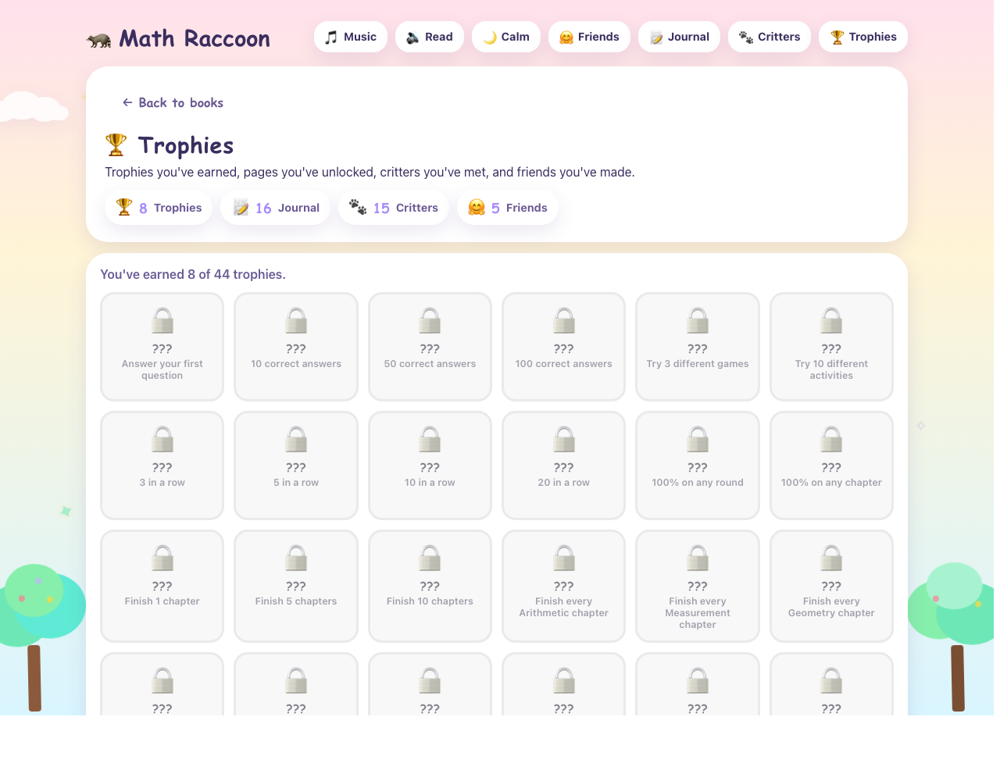

# Math Raccoon (3rd Grade Level)

A gentle, offline-friendly learning app for kids. Four math books — Arithmetic, Measurement, Geometry, Data — plus a Reading Raccoon module for vocabulary, grammar, phonics, figurative language, and comprehension. Each module has story chapters, arcade games, and a Teaching Corner. No ads. No tracking. No accounts.

**Repository:** <https://github.com/SFCyris/MathRaccoon>
**License:** [Apache 2.0](LICENSE) (source code) · [trademarks reserved](NOTICE.md)

---

## Screenshots

A quick tour of the app. All screens shown with a mid-journey demo profile.

### Hub



The hub: a greeting, the daily streak, the one-question Daily Challenge, and the five books — four math modules plus Reading Raccoon. The pill bar at the top is always there for Music, Calm mode, Friends, Journal, Critters, and Trophies.

### Inside a module



Each module has three tabs: **Book** (story chapters), **Adventure** (arcade warm-ups and boss rounds), and **Learn** (Teaching Corner). Chapters display progress and best-round score.



Reading Raccoon uses the same shape for vocabulary, grammar, phonics, similes, and comprehension.

### Teaching Corner



Each operation breaks down into multiple strategies — here, Addition splits into Count On, Make a Ten, Use Doubles, and Number Bonds. Each strategy has three screens: **The Idea** (the why, with a static visual), **Watch Me** (a step-by-step worked example with animations — the raccoon hops along the number line, fraction bars fill in, place-value blocks count up), and **Try** (practice with the same strategy). The **🎓 Learn more** button on every quiz hint card links straight back to the Teaching Corner page for that topic, so kids can revisit the strategy mid-round without losing their progress.

### Rewards gallery


**Journal** — story pages unlock chapter by chapter. Entries are grouped by module so the shelf stays tidy as it fills.



**Critters** — one baby animal per perfect round. Earned critters show in colour; the rest are outlined silhouettes.



**Friends** — one valley friend per completed chapter, grouped by module.



**Trophies** — milestone badges for firsts, streaks, and module completions.

### Parent Admin


The Parent Admin dashboard: at-a-glance progress, then tabs for Settings, Games (enable/disable/force-unlock), Chapters, printable Worksheets, and Advanced (full reset).

---

## Who it's for

- **Age / grade:** designed around US Grade 3–4. Earlier and later grades can still play at their own pace.
- **Learning styles:** built with neurodiverse players in mind. One question at a time, soft palette, no timers, no failure penalties, optional read-aloud, one-click **Calm mode** that dims animations, and **High-contrast** mode for low-vision players. Both off by default. The Teaching Corner uses gentle, **CPA-aligned** animations (concrete → pictorial → abstract): the raccoon visibly "hops" along a number line for skip-counting, fraction bars fill cell by cell, arrays appear dot by dot. All motion respects `prefers-reduced-motion` and Calm mode automatically.
- **Topics:** multi-digit addition/subtraction, multiplication, division, fractions, place value, patterns, rounding (Arithmetic); length, time, money, capacity, unit conversion (Measurement); shapes, perimeter, area, quadrilaterals, fraction partitioning (Geometry); bar graphs, pictographs, line plots (Data); vocabulary, grammar, phonics, similes/metaphors, reading comprehension (Reading Raccoon).

## Audio

The **🎵 Music** toggle in the top bar runs a small procedural lofi study-beat generated entirely in the browser via the Web Audio API — no audio files in the repo, nothing to download. You'll hear:

- A boom-bap rhythm (light snare on 2 & 4, hi-hats on every 8th, plus a soft pickup hat on the "and" of beat 4)
- A walking saw bass following the chord roots
- A light electric-piano comp playing rootless 7th voicings: **Cmaj7 → Am7 → Fmaj7 → G7**
- A jazzy lead picked from a small library of phrase templates (descending sparkles, ascending lifts, bebop runs, blues licks) — the lead never repeats the exact same phrase twice
- A subtle vinyl crackle bed for warmth

Tempo sits at 72 BPM, calmly. If you ever want a real recorded loop instead, drop an `mp3` into `assets/audio/` and call `MR.Audio.setMusicSrc("…")` during boot — it takes priority over the procedural fallback.

## Quick start

This is a plain static site — no build step, no Node, no npm.

**Option 1 — Just open the file.** Double-click `index.html`. Works in any modern browser.

**Option 2 — Static server.** From the project root:

```bash
python3 -m http.server 8123
```

Then open <http://localhost:8123>.

Saved progress lives in the browser's `localStorage` under `mathRaccoon::v2:*`.

## Administering

There are two ways into the Parent Admin:

- **Dedicated page:** open `admin.html` in the same folder (e.g. `http://localhost:8123/admin.html`). Bookmark it — kids shouldn't need it, so it isn't linked from the main UI.
- **Hidden hash route:** append `#/admin` to the app URL (e.g. `http://localhost:8123/#/admin`). Works the same, no password — just tucked away.

The admin view is tab-based: **Overview** (stats snapshot + quick toggles) · **Settings** (name, accessibility, audio) · **Games** (enable/disable, force-unlock, reset per game) · **Chapters** (force-unlock, reset per chapter) · **Worksheets** (print a paper worksheet with answer key for any arcade game) · **Advanced** (reset all progress). Games, Chapters, and Worksheets can be filtered by module with the chip row at the top.

### Save & Load (profile backup)

The sticky header has **💾 Save** and **📂 Load** buttons. Save downloads a JSON file bundling every `mathRaccoon::v2:*` key (settings, progress, achievements, chapters, journal, critters, friends, daily streak, daily challenge, admin flags). Load reads that file and replaces the current browser's data after a confirmation. Use it to move a profile between browsers or devices, or as a safety backup before a reset.

## Structure

```
index.html            Hub — shows the module tiles
admin.html            Parent-only dashboard (tabbed settings, Save/Load, worksheets)
shared/               Shared CSS (incl. admin.css), core JS, engines, viz, UI, critters
modules/
  arithmetic/         Numbers and operations
  measurement/        Units, time, money
  geometry/           Shapes, symmetry, area
  data/               Graphs, averages
  reading/            Reading Raccoon — vocab, grammar, phonics, comprehension
pools/                Arcade question pools — safe for teachers to edit
assets/               Icons and audio
```

## Editing arcade questions (for teachers & parents)

Every arcade game draws its questions from a plain-text **pool file** in the
`pools/` folder. You can open any file in a text editor, add or edit
questions, save, and reload the page — no code changes, no build step.

### How a round uses the pool

Each round asks a fixed number of questions (usually 6 or 8), drawn at
**random and without duplicates** from the pool. A pool with 24 questions
will feel far more varied than a pool with just 8 — **aim for at least 3×**
the round size so each playthrough feels fresh. Missed questions can be
retried at the end of the round with a "🔁 Retry N missed" button.

### Where to find the right file

Pool filenames follow this pattern:

```
pools/<mascot>-raccoon-<module>-arcade-<game>.js
```

Examples:
- `pools/math-raccoon-arithmetic-arcade-bubble-blocks.js` — Addition sprints
- `pools/math-raccoon-measurement-arcade-coin-cart.js` — Money stories
- `pools/reading-raccoon-arcade-simile.js` — Similes

Open any pool file and the comment at the top explains its exact format.

### The three most common question shapes

**1. Arithmetic (add, subtract, multiply, divide)** — the engine computes
the answer and renders the big equation automatically. You just author the
numbers:

```js
{ "a": 34, "b": 28, "hint": "Carry the ten when ones sum > 9." }
```

**2. Word-problem / text question** — teacher writes the full prompt. The
engine builds the multiple-choice options from the correct answer:

```js
{
  "prompt":  "🐿️ Squirrel buries 24 acorns, then hides 13 more. Total?",
  "answer":  37,
  "suffix":  "",
  "hint":    "Put both amounts together — add."
}
```

You can use simple HTML in the `prompt`: `<em>…</em>`, `<strong>…</strong>`,
line breaks (`<br>`), and emoji all work.

**3. Multiple-choice text question** (for reading arcades and similar):

```js
{
  "prompt":  "<em>Her smile was as bright as the sun.</em><br>What does this simile mean?",
  "options": ["Her smile was very bright.", "Her smile was yellow.", "Her smile was hot.", "Her smile was round."],
  "answer":  "Her smile was very bright.",
  "hint":    "The sun is famously bright."
}
```

The `answer` string **must exactly match** one of the `options`.

**4. True / False equation** (tests operation equivalence — CCSS 3.OA.D.9):

```js
{
  "prompt":  "🤔 Is this equation true or false?<br><strong>24 ÷ 8 = 6 ÷ 2</strong>",
  "options": ["True", "False"],
  "answer":  "True",
  "hint":    "24 ÷ 8 = 3, and 6 ÷ 2 = 3."
}
```

**5. Pick-an-item / affordability question:**

```js
{
  "prompt":  "💵 Maria has $11 left. Which ONE item can she afford?",
  "options": ["A shirt for $12", "A book for $13", "A set of markers for $9"],
  "answer":  "A set of markers for $9",
  "hint":    "She needs a price ≤ $11."
}
```

Shapes 3–5 all use the same `options` + exact-match `answer` convention —
choose whichever wording fits the learning goal. These work in any arcade
that uses the **word-problem** engine (word-wander, story-solver, coin-cart,
shape-sleuth, etc.). The pool file's header comment names the engine.

### Adding a new question

1. Open the pool file for the arcade you want to extend.
2. Add a new `{ … }` object to the `questions` array. Match the shape shown
   in the file's header comment and the surrounding examples.
3. Put a comma between every question object — the last one has no comma.
4. Save the file. Reload the page.

If the page breaks after editing, the most common cause is a missing comma
or an unmatched quote — open your browser's developer console (F12) and it
will point to the exact line.

### Removing or rewording

Delete the whole `{ … }` object (and the comma that follows it), or change
the text inside the quotes. The pool needs at least as many questions as
`askedPerRound`, but strongly prefers 3× that number.

## License, trademarks, and attribution

Source code under Apache 2.0. Math Raccoon™ and related marks are reserved — see [NOTICE.md](NOTICE.md). Please rename any public fork.

Copyright © 2026 S. F. Cyris.
