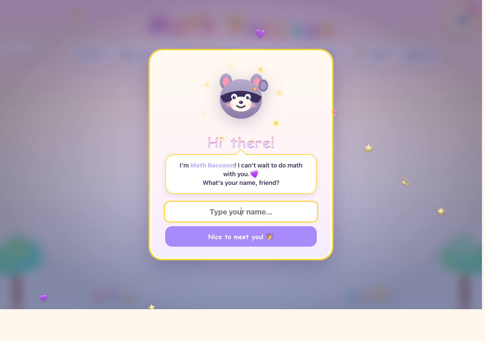
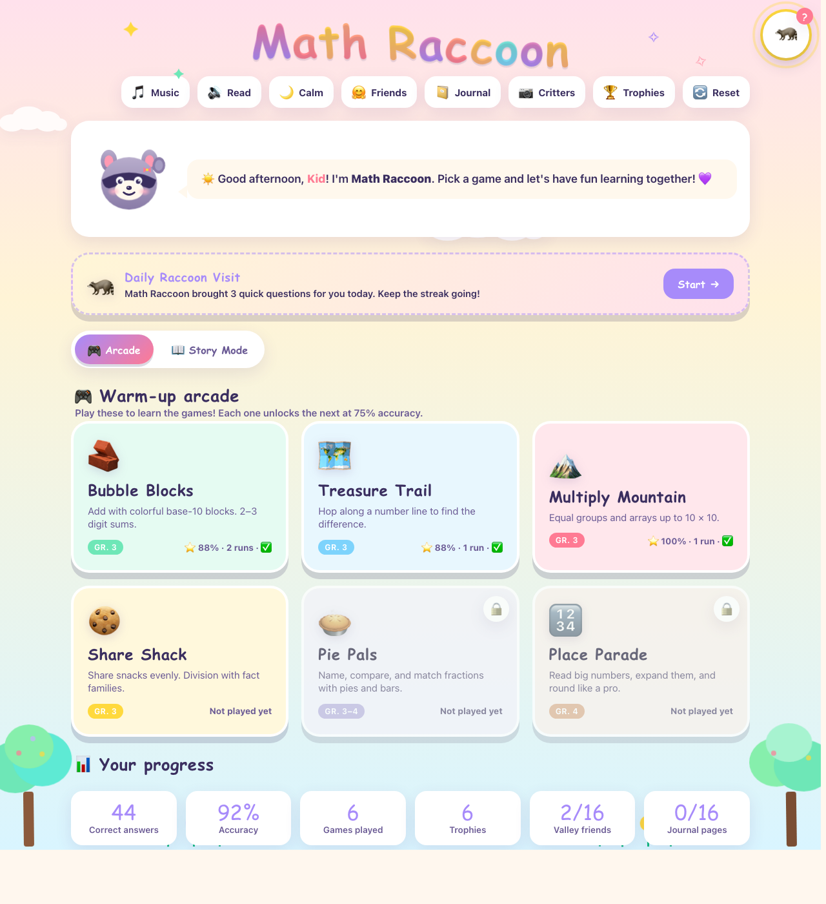
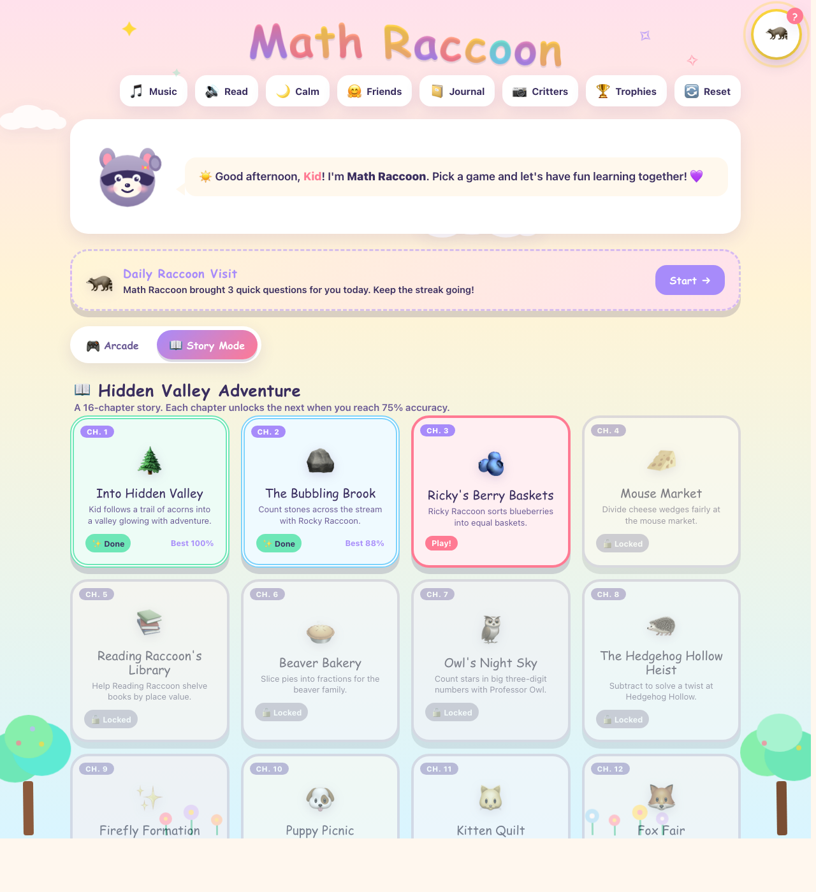
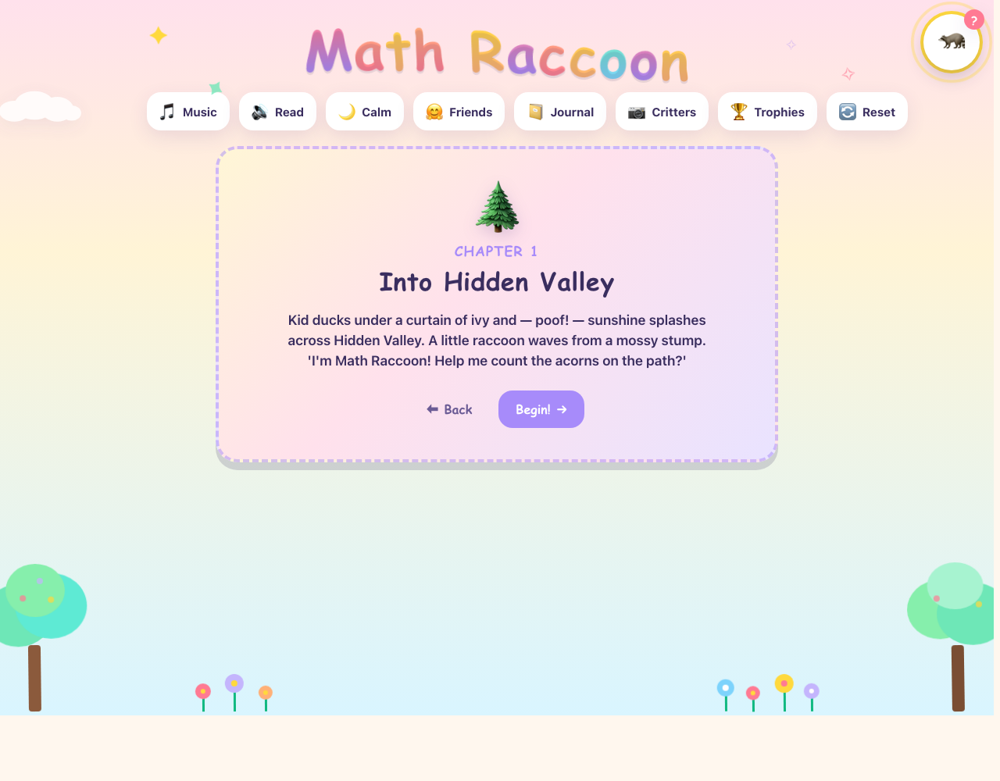
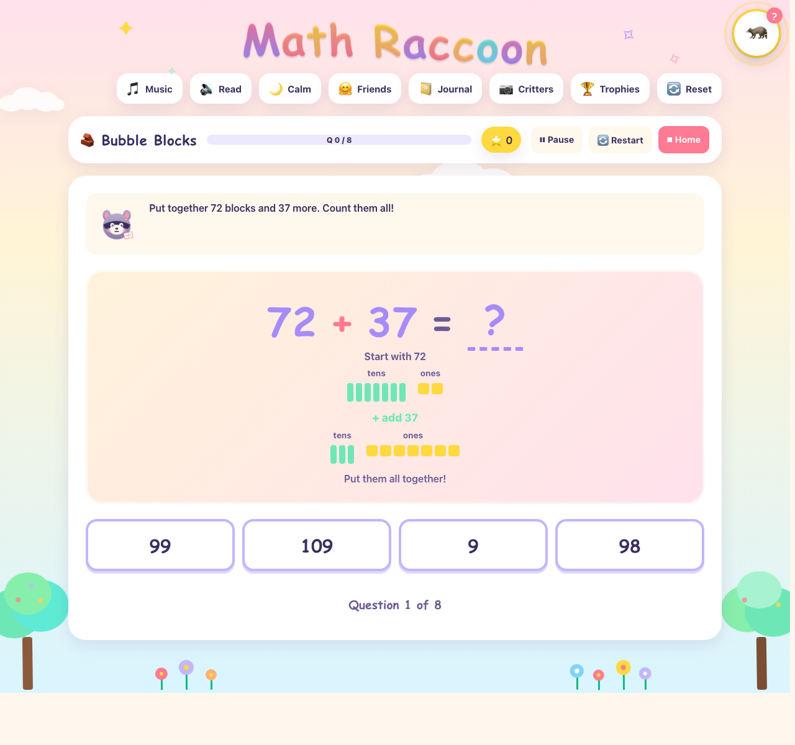
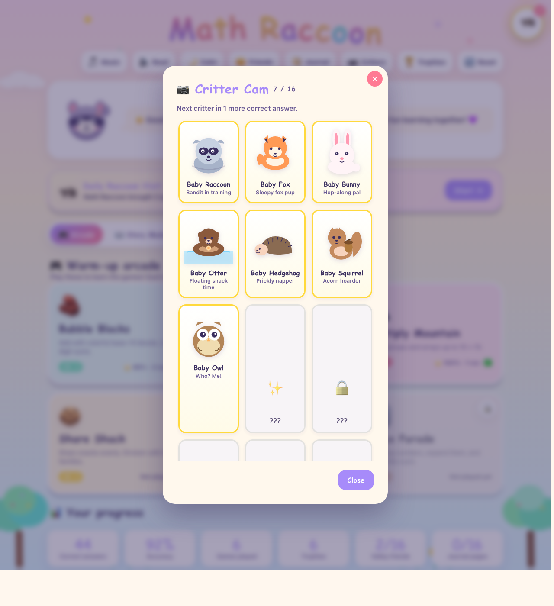
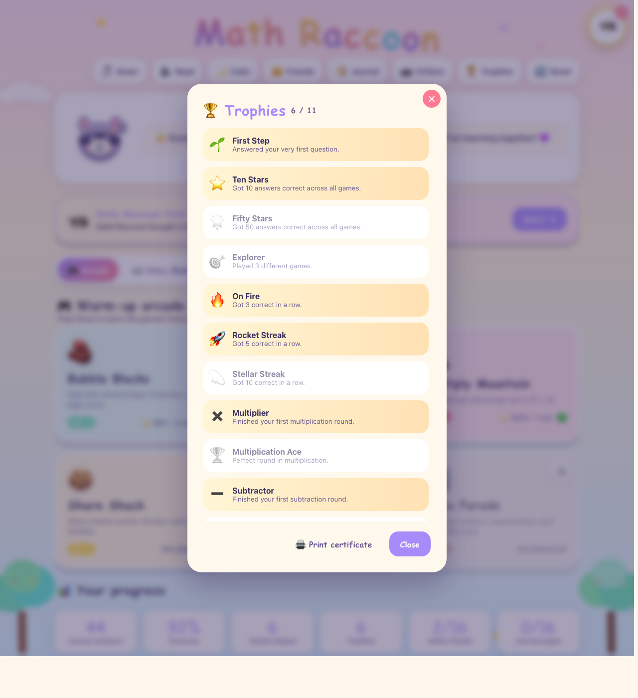
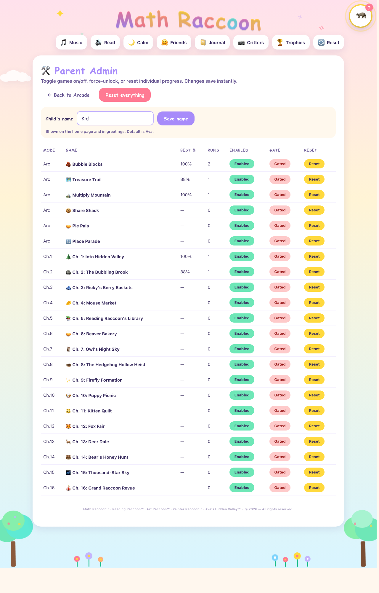

# Math Raccoon Arcade

A gentle, offline-friendly math arcade for kids. A little raccoon greets the player by name, walks them through sixteen story chapters, and celebrates every correct answer. No ads. No tracking. No accounts.

**Repository:** <https://github.com/SFCyris/MathRaccoon>
**License:** [Apache 2.0](LICENSE) (source code) · [trademarks reserved](NOTICE.md)

---

## Screenshots

<p align="center">
  
  &nbsp;
  
</p>
<p align="center">
  <em>First-run welcome overlay</em> &nbsp;·&nbsp; <em>Home — warm-up arcade tab</em>
</p>

<p align="center">
  
  &nbsp;
  
</p>
<p align="center">
  <em>Story mode map — 16 chapters</em> &nbsp;·&nbsp; <em>Chapter intro panel</em>
</p>

<p align="center">
  
  &nbsp;
  
</p>
<p align="center">
  <em>In-game question (addition)</em> &nbsp;·&nbsp; <em>Critter Cam gallery</em>
</p>

<p align="center">
  
  &nbsp;
  
</p>
<p align="center">
  <em>Trophies modal</em> &nbsp;·&nbsp; <em>Parent admin page (#admin)</em>
</p>

> Screenshots captured on a local build with seeded progress. Visuals may differ slightly between browsers and platforms.

---

## Who it's for

- **Age / grade:** Designed around the **US Grade 3 – Grade 4** math curriculum. Younger children can play the warm-up arcade at a slower pace; older children can run through to the story finale.
- **Learning style:** Built with neurodiverse players in mind. Predictable pacing, one question at a time, soft pastel palette, no timers, no failure penalties, optional read-aloud, and a one-click *Calm mode* that dims animations.
- **Math topics covered:**
  - Multi-digit addition and subtraction (with and without regrouping)
  - Multiplication facts and arrays
  - Division and fact families
  - Fractions — naming, comparing, equivalent fractions
  - Place value, rounding, expanded form
  - A final mixed-review chapter

---

## The story

Ducking under a curtain of ivy, the child steps into **Ava's Hidden Valley™** — a sun-dappled meadow tucked behind a waterfall of leaves. A little raccoon waves from a mossy stump: *"I'm Math Raccoon! Help me count the acorns on the path?"*

Across sixteen chapters the child meets:

- **Rocky and Ricky**, the twin raccoons of brook and berry-basket
- **Market Mice**, who always share the cheese evenly
- **Reading Raccoon**, keeper of the hollow-oak library
- **Beaver Bakers**, slicing pies into fractions
- **Professor Owl** and his constellation scrolls
- **Tuck the hedgehog**, caught in a mystery of missing coins
- **Firefly Troupe**, **Picnic Puppies**, **Quilt Kittens**
- the **Fair Fox**, the **Deer Clan**, and **Grandpa Bear**
- and a thousand-star sky for the grand finale

Each chapter unlocks the next at 75% accuracy. The story closes with a grand revue that mixes every topic together and ends with fireflies spelling the child's name across the valley sky.

---

## What's inside

- **Warm-up arcade** — six short games, one per topic, to learn each mechanic before story mode.
- **Story mode** — sixteen chapters, each with an illustrated intro, a round of problems, and a warm outro.
- **Valley Friends album** — sixteen collectible character stickers, one per chapter.
- **Reading Raccoon's Journal** — sixteen short illustrated reads unlocked alongside each chapter.
- **Critter Cam** — a drip-unlock gallery of sixteen original baby-critter SVG drawings; one unlocks per five correct answers.
- **Trophies** — achievements for streaks, milestones, and gentle surprises.
- **Daily Raccoon Visit** — three quick questions, once a day. A streak counter encourages habit without pressure.
- **Printable certificate** — a one-click print-ready certificate with the child's name, trophies, and stats.
- **Read-aloud** — a soft speech-synthesis voice reads hints, narration, and feedback. Off by default.
- **Calm mode** — softens motion, confetti, and title-bar animation for bedtime or sensory-sensitive sessions.

---

## Quick start

This is a plain static site — no build step, no Node, no npm, no dependencies. There are two ways to run it.

### Get the code

**Option A — clone with git:**

```bash
git clone https://github.com/SFCyris/MathRaccoon.git
cd MathRaccoon
```

**Option B — download a ZIP:** open <https://github.com/SFCyris/MathRaccoon>, click the green **Code** button, choose **Download ZIP**, and unzip it anywhere on your computer.

Once you have the folder locally, pick one of the two run options below.

### Option 1 — Just open the file

Double-click **`index.html`** (or right-click → *Open with* → your browser of choice). Everything loads locally: HTML, CSS, JS, SVG art, and sound. Works in any modern browser (Chrome, Edge, Firefox, Safari).

This is the easiest path for a single home computer or tablet. Saved progress lives in that browser's `localStorage`, so it'll remember the child between sessions as long as the same browser profile is used.

> A small caveat: a few browsers restrict `localStorage` for pages opened via `file://`. If progress doesn't persist between reloads, use Option 2 instead.

### Option 2 — Host as a static site

From the project root:

```bash
python3 -m http.server 8123
```

Then open **http://localhost:8123** in any modern browser.

Any other static server works too: VS Code Live Server, `npx serve`, `caddy file-server`, or any shared hosting that serves static files. Nothing runs server-side — everything happens in the browser.

### Offline use

Once the page has loaded, the app runs fully offline. All saved progress, settings, and collectibles live in browser `localStorage` under keys prefixed with `mathRaccoon::v1:`. There is no network access and no tracking.

---

## First run

On the very first visit, Math Raccoon appears in a welcome window and asks for the child's name. The name is saved in the browser and used throughout the greetings, story narration, and praise messages. It can be changed later in the admin page.

---

## Administering

### Admin page

Append `#admin` to the URL — for example `http://localhost:8123/#admin`. There is no password. The URL is tucked away rather than locked: the goal is to keep the panel out of a child's way, not to keep grown-ups out.

From the admin page a parent can:

| Action | What it does |
|---|---|
| **Edit child's name** | Up to 24 characters. Applies immediately to greetings, story text, and praise. |
| **Enable / disable any game** | Disabled games disappear from the arcade and story lists. |
| **Force-unlock a chapter** | Bypasses the 75 % gate if a child is stuck or wants to jump ahead. |
| **Reset one game** | Wipes just that game's progress, leaving everything else intact. |
| **Reset everything** | Wipes all progress, trophies, story state, friends, journal, critters, and clears the name so the welcome overlay plays again on the next visit. Music, calm, and read-aloud preferences are preserved. |

### Home-page controls

The top row of buttons is live-toggleable by anyone:

- **Music** — gentle loop (off by default).
- **Read** — soft read-aloud voice (off by default).
- **Calm** — reduced motion and softer visuals.
- **Friends / Journal / Critters / Trophies** — open the collection modals.
- **Reset** — child-facing reset; asks for confirmation.

---

## Parent tips

- The **75 % unlock gate** is intentional. If it feels harsh, use *force-unlock* on the admin page rather than disabling the gate entirely.
- **Calm mode** is good for bedtime play and sensory-sensitive sessions.
- **Read-aloud** helps early readers and passive-play scenarios.
- The **Daily Raccoon Visit** is a small habit-builder, not a practice substitute.
- Progress lives only in the browser you're using. If a child plays on a different device or cleared their site data, start fresh.

---

## Project structure

Vanilla HTML, CSS, and JavaScript — no build step, no framework.

```
index.html              Entry point
css/                    Styling (main, arcade, games)
js/
  app.js                Routes, modals, welcome overlay
  storage.js            localStorage persistence
  raccoon.js            Math Raccoon character (inline SVG)
  critters.js           16 baby-critter SVG gallery
  gameRegistry.js       Game metadata registry
  gameRunner.js         Generic round runner
  engines/              Reusable math engines
  games/                Arcade and story registrations
```

Clearing site data in DevTools (Application → Storage → Clear site data) is the nuclear reset.

---

## License, trademarks, and attribution

- **Source code** is licensed under the **[Apache License, Version 2.0](LICENSE)**. You may read, fork, run, modify, and redistribute it (including commercially) as long as you follow the Apache 2.0 conditions — keep the `LICENSE` and `NOTICE.md` files, retain copyright/attribution notices, and mark any modified files as changed.
- **Math Raccoon™**, **Reading Raccoon™**, **Art Raccoon™**, **Painter Raccoon™**, and **Ava's Hidden Valley™** are unregistered common-law trademarks of the author. The Apache 2.0 license does **not** grant trademark rights (see § 6 of the license). Please rename any public fork so there's no brand confusion.
- Copyright © 2026 S. F. Cyris. Original SVG artwork, character designs, and narrative text remain the author's creative works.
- Built with AI assistance under human direction and review.

See **[NOTICE.md](NOTICE.md)** for the full attribution notice.

## Contact

For licensing, permissions, or general questions: **scyris@outlook.com**

---

*This is a hobby project made with care. It is not a curriculum replacement and is not affiliated with any school, publisher, or educational-technology company.*
